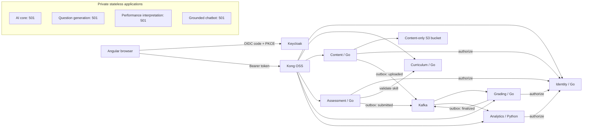
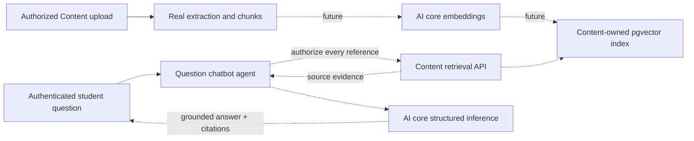

# Architecture actually implemented

There is no synchronous chain through the AI applications and no circular dependency. Each persistent application connects only to its own database. Database and schema grants enforce the boundary; identifiers across services are references, not cross-database foreign keys. Assessment validates skill references through Curriculum. Identity is the policy owner for classroom access; bearer tokens forwarded by a business service are revalidated at Identity. No user identity headers are trusted.

Go domain files implement exact grading, assessment validation and text chunking without framework/database dependencies, except the small transport UUID helper used by assessment validation (a remaining layering cleanup). SQL is explicit, application transactions are visible in handlers, and source remains intentionally small. The shared Go package implements transport, auth, connection lifecycle, outbox plumbing and consumer inboxes; it owns no educational entity. Python's shared package implements auth/error/logging only.

## Data owners

Identity owns `organizations`, `users`, `classrooms`, `enrollments`. Curriculum owns `nodes`, `prerequisites`. Content owns `documents` including extracted chunks and SHA-256/source revision metadata, plus bucket objects. Assessment owns `assessments` with question snapshots and answer keys, and `submissions`. Grading owns `evaluations`, `audit`. Analytics owns its `evaluations`, `evidence` and `inbox` read model. Outbox/inbox tables are independently created in the application owner's database, not a shared event database.

The first migration is non-destructive and idempotent. Go migrations are embedded from each service's `migrations/001_init.sql` and applied under a PostgreSQL advisory transaction lock. Future schema changes require numbered migrations and a dedicated runner before changing existing definitions; `CREATE TABLE IF NOT EXISTS` is not an upgrade mechanism. Production migrations should run with separate owner credentials; local app roles own only their own database.

## Security and state

Kong verifies RS256 and expiration using the provisioned issuer/public key. Backends also verify issuer/audience/expiration, organization and application role. Classroom teachers can act only on their own classrooms. Students require enrollment and can query only their own evidence. Students never receive answer keys from Assessment's public projection. The broker's assessment topic contains confidential answer-key snapshots and must receive strict production ACLs.

Assessments are published immediately and immutable. Submission is unique by assessment/student. Grading drafts are unique by submission, remain invisible to analytics until a teacher commits finalization, and store reason plus before/after evidence in an audit table. Finalization locks the evaluation row and atomically writes the updated record, audit and outbox event. Retrying finalization receives 409. Analytics separately deduplicates event IDs and evaluation IDs so a new event ID for the same finalized grade cannot add evidence twice.

## Future AI and RAG

All dashed steps are future work. Content's `ports.go` defines retrieval/indexing interfaces; no implementation is registered. Four private Python applications define versioned input/output contracts and return `AI_CAPABILITY_NOT_IMPLEMENTED` (501) after authentication, role checking and validation. They do not access business data, call providers, or use test doubles in runtime code. The agent contracts carry untrusted references; accepting a syntactically valid reference is not authorization to retrieve it.

Future pgvector migration: enable the extension with a Neon migration role; add Content-owned embeddings keyed by document/revision/chunk and model/chunker/dimensions; build a new index alongside the old one; validate real coverage and access filtering; switch the active version atomically. Emit `content.indexed.v1` only after real indexing commits. Keep deleted/revised content out of retrieval and preserve citation provenance. No such topic is currently created or published.
